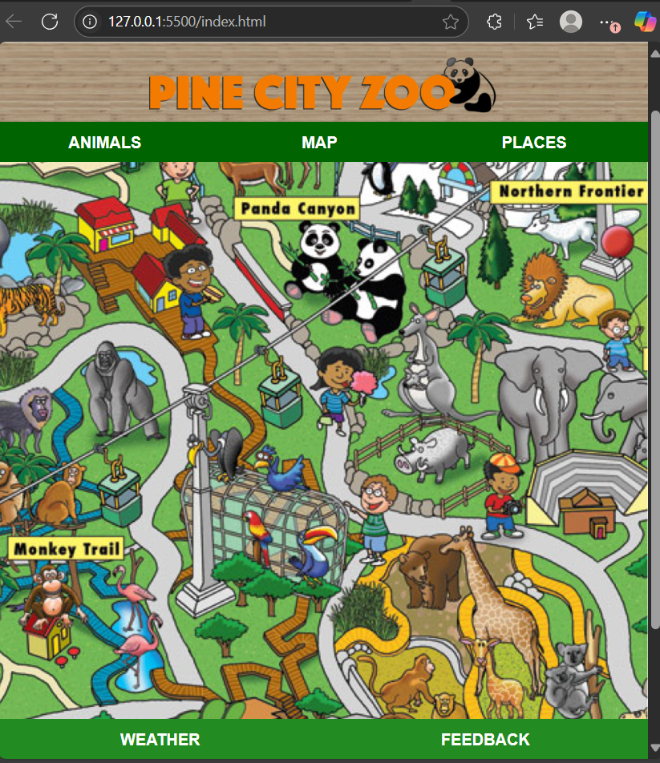
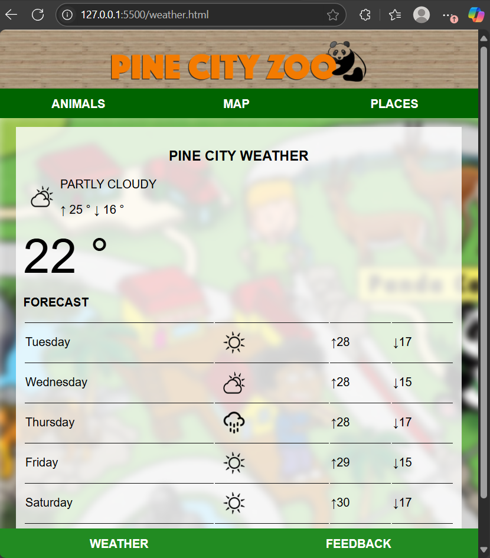
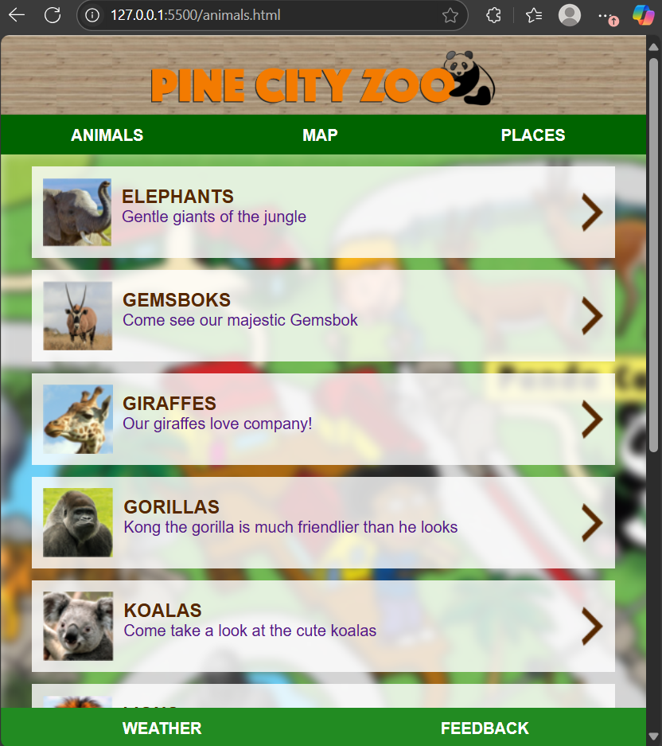
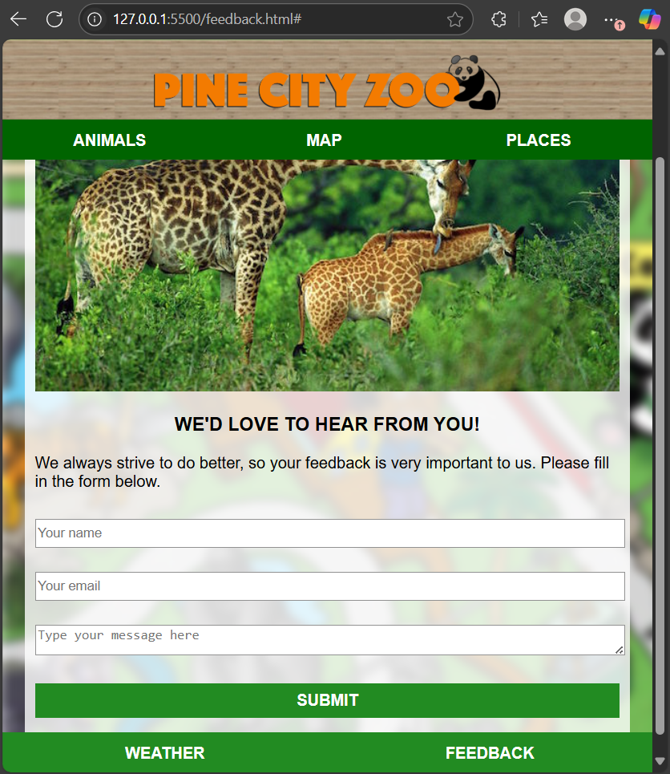
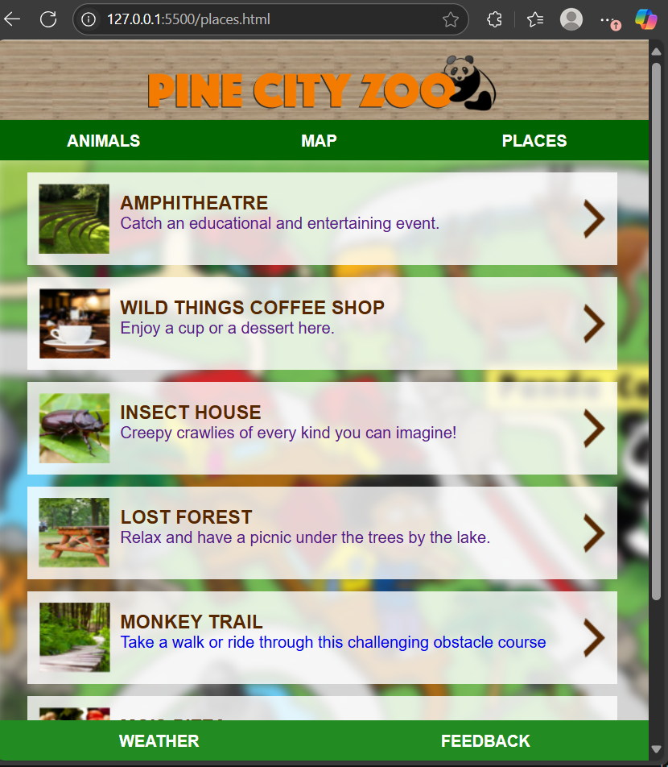

# 🏞️ Pine City Zoo Web Application

Welcome to the **Pine City Zoo**, a fully client-side web experience built using only HTML and CSS. This interactive site is designed to guide visitors through the zoo’s attractions, provide useful information and showcase the vibrant life within Pine City Zoo.

## 📌 Features

- **Home Page** (`index.html`)  
  Displays a visual map of the zoo for easy navigation.

- **Weather Page** (`weather.html`)  
  Shows current weather conditions to help visitors plan their visit.

- **Animals Page** (`animals.html`)  
  Features a gallery of animals with dedicated pages for lions, gorillas, pandas and more.

- **Feedback Page** (`feedback.html`)  
  Allows visitors to submit feedback and view confirmation prompts.

- **Places Page** (`places.html`)  
  Highlights restaurants, cafés and sightseeing spots like the amphitheatre and monkey trail.

## 🖼️ Screenshots

| Page | Preview |
|------|---------|
| Home |  |
| Weather |  |
| Animals |  |
| Feedback |  |
| Places |  |

## 🛠️ Technologies Used

| Language | Purpose |
|----------|---------|
| HTML     | Page structure and content |
| CSS      | Styling, layout, and visual effects |

## 👨‍💻 Developer

Created by **Neo ‘Roro’ Hlumbene**  
A creative front-end developer passionate about interactive design, animations and user experience.

## 💡 Notes

- This project is static and does not use JavaScript or server-side technologies.
- Feedback submission is simulated with a confirmation page (`message-received.html`).
- Each animal has its own dedicated HTML page for detailed viewing.

